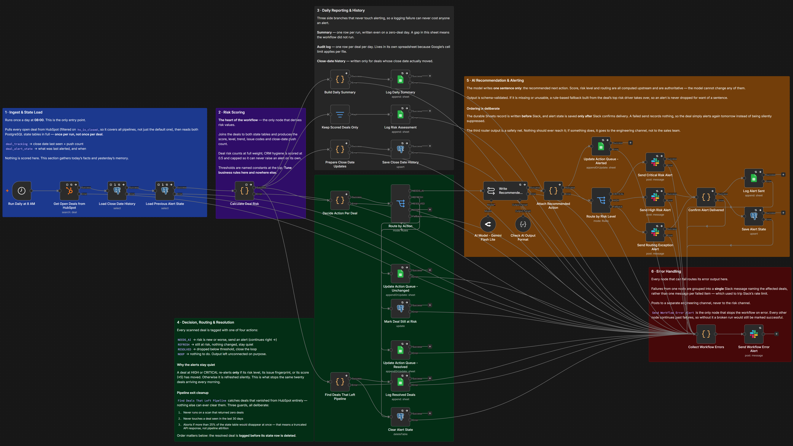
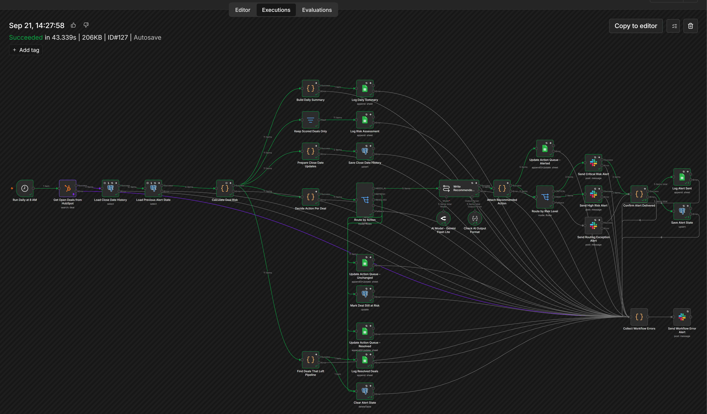
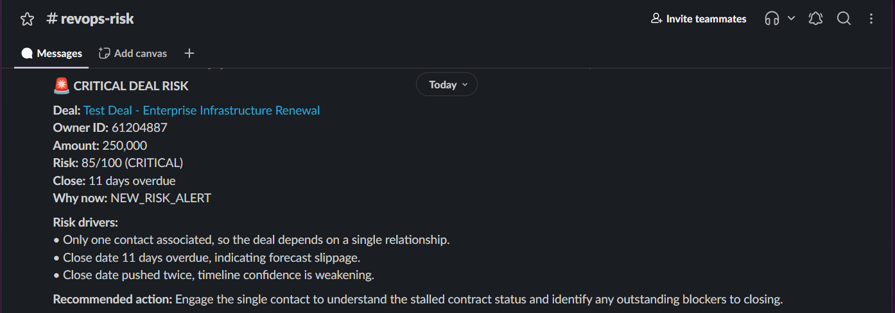
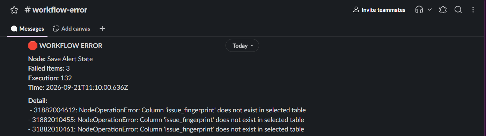
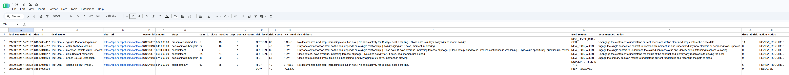
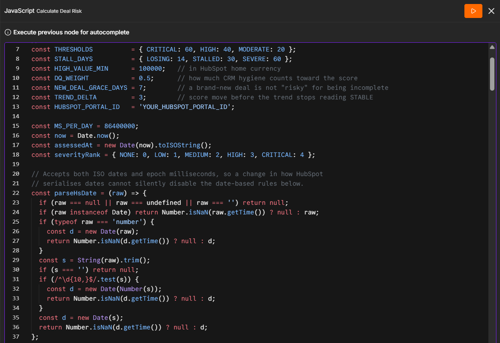

# RevOps Deal Risk Assessment & Alert System

A self-built portfolio case study exploring how a RevOps team could identify
changing sales-deal risk without relying on repetitive daily reports.

The prototype uses n8n, HubSpot, PostgreSQL, Slack, Google Sheets and a narrow
AI-assisted recommendation step. It evaluates open deals against explicit
business rules, remembers what it has already alerted, and sends a new
notification only when the situation materially changes.

> **Project status:** This is a portfolio prototype, not a production system.
> It has not been deployed for a client or run inside a sales organisation.
> All included records are synthetic, and no business results or predictive
> accuracy figures are claimed.

[Technical architecture](docs/architecture.md) · [Demo setup](SETUP.md) ·
[Sample output](examples/sample-output.md)

**What it does:** reads every open HubSpot deal each morning, scores it
against explicit business rules, and posts a Slack alert only when that
deal's risk has materially changed since the last alert. State lives in
PostgreSQL; the human-facing queue lives in Google Sheets.

## Case Study Summary

### Context

Sales teams often have the information needed to identify deal risk, but the
signals are distributed across CRM fields, activity history, close-date
changes and contact relationships. A daily report can expose these signals,
but repeated alerts quickly become noise.

### Challenge

The design challenge was to create a workflow that could:

- identify stalled or deteriorating deals;
- distinguish revenue risk from CRM data-quality problems;
- remember previous alerts;
- avoid repeating unchanged alerts;
- explain why a deal was classified as risky; and
- remain safe when upstream data is incomplete or unexpectedly missing.

### Approach

I designed a stateful n8n workflow that reads open deals from HubSpot,
calculates a deterministic risk score, stores comparison state in PostgreSQL,
writes an operational queue to Google Sheets, and sends material alerts to
Slack.

A language model is used only to phrase one recommended next action. It does
not calculate the score or decide whether a deal should be alerted.

### Outcome

The result is a reproducible workflow prototype demonstrating:

- explainable, rule-based scoring;
- state-aware alert suppression;
- close-date push tracking;
- separate treatment of deal risk and data quality;
- guarded cleanup of stale state; and
- delivery-confirmed alert persistence.

The outcome is a technical demonstration, not a claim of business impact.

## My Role

I designed and implemented the prototype end to end, including:

- defining the business problem and risk signals;
- designing the scoring and alerting policy;
- specified and implemented with AI assistance;
- designing the PostgreSQL state model;
- creating the Slack and Google Sheets outputs;
- adding error-handling and cleanup safeguards; and
- documenting assumptions, limitations and setup steps.

## Solution

The workflow runs once each morning:

```text
Daily trigger
  -> HubSpot deal fetch
  -> PostgreSQL state load
  -> Deterministic risk scoring
  -> Change detection
  -> AI-assisted action wording
  -> Google Sheets queue
  -> Slack alert
  -> Confirmed state update
```

The design separates three concerns:

1. **Scoring** - deterministic calculation of deal and data-quality risk.
2. **Decisioning** - comparison with the previous alert state.
3. **Delivery** - action queue, Slack notification and persistence.

## Screenshots

### Workflow architecture

The n8n workflow connects HubSpot ingestion, deterministic risk scoring,
PostgreSQL state management, Google Sheets logging and Slack alerting.



### Workflow execution

A completed execution showing the workflow paths and node results.



### Critical-risk Slack alert

A synthetic alert containing the risk level, contributing signals and
recommended next action.



### Workflow error alert

Node failures are grouped into one engineering-channel message naming the
affected deals, rather than one message per failed item. The sales channel
never sees it.



### RevOps action queue

The Google Sheets queue provides a human-readable view of deals that require
attention.



## Key Design Decisions

### Deterministic scoring instead of AI-generated scoring

The score is calculated from explicit business rules so that it is
explainable and testable. The language model is limited to a single
recommended-action sentence and cannot change the score, risk level or
routing decision.

### PostgreSQL for machine state

PostgreSQL stores the state required to compare today's scan with previous
runs. Google Sheets is the human-facing operational surface, not the source of
truth for alerting logic.

### Alert only on meaningful change

A deal is alerted when it is newly risky, changes risk level, changes its set
of issues, or moves by at least five score points. An unchanged risky deal is
refreshed silently.

### Delivery before persistence

Alert state is saved only after Slack confirms delivery. If delivery fails,
the deal remains eligible for the next alert attempt.

This applies to the PostgreSQL alert state, which is what controls
suppression. The Google Sheets action queue is written before the Slack send
so that a Sheets failure can never block an alert; a failed send therefore
leaves a queue row whose deal will be alerted again on the next run.

### Guarded cleanup

Deals missing from a scan are not immediately deleted from state. Cleanup is
skipped for empty scans, ignores recently seen records, and aborts if an
unexpectedly large portion of state would disappear.

### Failure modes this handles

| Failure | Guard |
|---|---|
| Empty state tables on a cold start | Both state loads run once and always emit, so the scoring node is never skipped |
| HubSpot returns a truncated list | Pipeline-exit cleanup aborts rather than deleting a quarter of the state table |
| HubSpot changes its date serialisation | Dates are parsed from ISO strings and epoch milliseconds alike |
| CRM automation resets last-modified | Momentum prefers real sales activity, and records which source it used |
| Slack delivery fails | Alert state is not written, so the deal re-alerts tomorrow |
| The AI returns nothing usable | A rule-based fallback built from the deal's top risk driver |
| A prompt-injection attempt in a deal name | Deal text is stripped, and the model is told the deal block is data |
| Many items fail at once | Errors are grouped into one message per node per delivery branch, not one per item |

## Example Result

For synthetic demo data, a deal with 45 days of inactivity, a close date five
days away, and a missing next step produces this result:

| Component | Points |
|---|---:|
| `STALLED_DEAL` | 35 |
| `NEAR_CLOSE_EXECUTION_GAP` | 20 |
| `MISSING_NEXT_STEP` at half weight | 5 |
| **Final score** | **60 - CRITICAL** |

The resulting Slack message identifies the drivers and recommends contacting
the buyer to confirm whether the evaluation is still active and reset the
close date.

This is synthetic output used to demonstrate workflow behavior. It is not a
real customer, deal or alert.

## What I Learned

- Alerting is largely a state-management problem: the difficult question is
  often whether tomorrow's result is materially different from today's.
- Data quality should not automatically equal revenue risk. Missing fields
  matter, but treating every incomplete record as a high-risk deal creates
  alert fatigue.
- AI is more useful when its scope is narrow enough to validate and control.
- Failure paths need to be designed before the happy path, including empty
  API responses, incomplete activity data and failed Slack delivery.

## Limitations

- The scoring weights are reasoned assumptions, not validated against
  historical outcomes.
- There is no outcome-trained model, so the score is not a probability of
  winning or losing.
- Stage-specific thresholds are not implemented.
- The workflow depends on CRM activity being logged consistently.
- Google Sheets is suitable for a demonstration queue, but a long-running
  implementation would need retention and rotation.
- An outage of the AI node can still block that alert branch; improving the
  full-outage fallback is a future enhancement.

## Technology

| Area | Technology |
|---|---|
| Orchestration | n8n |
| State store | PostgreSQL |
| CRM source | HubSpot Deals API |
| Notifications | Slack |
| Reporting surface | Google Sheets |
| Workflow logic | JavaScript in n8n Code nodes |
| AI assistance | Google Gemini 2.5 Flash Lite via OpenRouter |

## Repository Structure

```text
n8n-revops-deal-risk-alert-system/
├── README.md
├── SETUP.md
├── LICENSE
├── NOTICE
├── .gitignore
├── workflow/
│   └── revops-deal-risk-assessment-and-alert-system.json
├── database/
│   ├── schema.sql
│   └── sample-data.sql
├── docs/
│   ├── architecture.md
│   └── screenshots/
└── examples/
    ├── pin-data-hubspot-deals.json
    └── sample-output.md
```

### Scoring engine

Every threshold, weight and grace period is a named constant at the top of a
single node. The score is calculated here and nowhere else.



## Project Status

This is a self-built portfolio project published openly to demonstrate
business-process analysis, workflow design, business-rule implementation,
PostgreSQL integration and automated risk alerting with n8n.

It is a demonstration and prototype. It has not been deployed for a client,
has not run inside a sales organisation, and contains no real customer data.

## Third-Party Names and Services

HubSpot, Slack, Google Sheets, PostgreSQL, n8n, Gemini and OpenRouter are
trademarks or services of their respective owners. This project is an
independent portfolio prototype and is not affiliated with, sponsored by or
endorsed by those organizations.

Screenshots are provided only to document this project's workflow and
synthetic demonstration data.

## License

The original project content - workflow configuration, documentation, SQL,
synthetic sample data and the pinned demonstration dataset - is released under
the MIT License. See [LICENSE](LICENSE) and [NOTICE](NOTICE) for the scope of
that grant and for the third-party material it does not cover.

Third-party services, names, trademarks, logos and interfaces remain subject to
their respective owners' terms.
