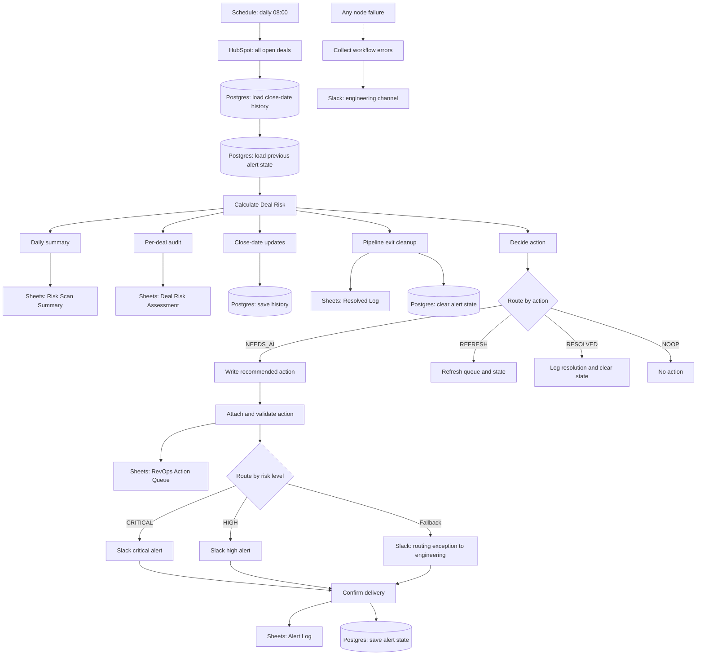
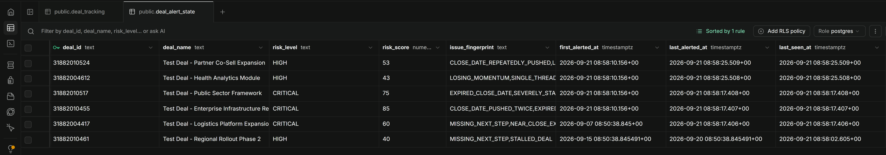
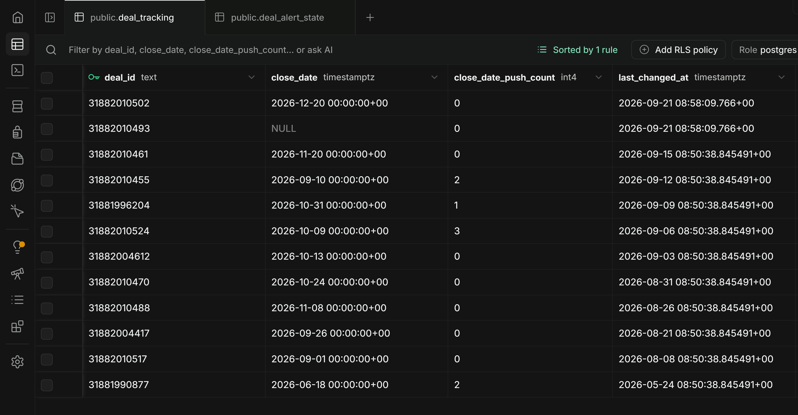
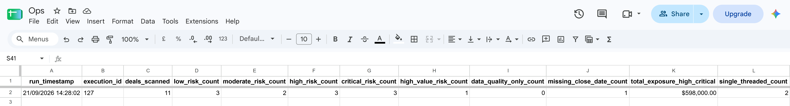
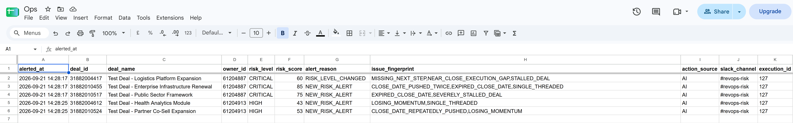
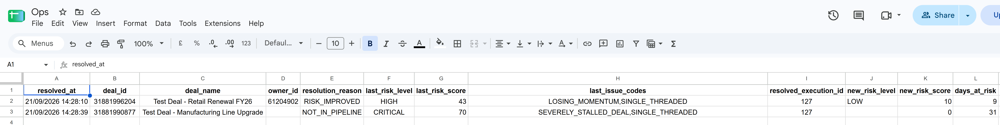

# Technical Architecture

This document describes the design of the RevOps deal-risk portfolio
prototype. It focuses on the reasoning behind the workflow rather than on
installation steps.

## Workflow Architecture



The scoring node fans out into independent reporting, history, cleanup and
alerting paths. Logging failures should not silently prevent an alert, while
alert state should not be written before delivery is confirmed.

## Workflow Stages

| Stage | Responsibility |
|---|---|
| Trigger | Starts the daily scan at 08:00 in the workflow's own timezone setting. |
| Ingest | Reads all open deals from HubSpot. |
| Load state | Reads close-date history and previous alert state once per run. |
| Score | Produces risk score, level, trend, issue codes and push count. |
| Report | Writes one summary row per run and one audit row per deal. |
| Persist history | Records close-date movement. |
| Cleanup | Finds deals that left the pipeline and closes their state. |
| Decide | Routes each deal to `NEEDS_AI`, `REFRESH`, `RESOLVED` or `NOOP`. |
| Recommend | Creates and validates one recommended-action sentence. |
| Alert | Writes the action queue and posts HIGH or CRITICAL messages. |
| Record | Saves alert state only after confirmed delivery. |
| Errors | Groups workflow failures for an engineering-channel notification. |

The unconnected `NOOP` output is intentional. Fallback outputs from routing
switches are connected to engineering error handling because unexpected
routing indicates a workflow defect.

## Risk Model

The score is deterministic. Two components are calculated separately and
combined at the end.

### Deal risk signals

| Signal | Condition | Points |
|---|---|---:|
| `SEVERELY_STALLED_DEAL` | No sales activity for 60+ days | 45 |
| `STALLED_DEAL` | No sales activity for 30-59 days | 35 |
| `LOSING_MOMENTUM` | No sales activity for 14-29 days | 18 |
| `SINGLE_THREADED` | Exactly one associated contact | 25 |
| `EXPIRED_CLOSE_DATE` | Close date is overdue | 12-55 |
| `CLOSE_DATE_REPEATEDLY_PUSHED` | Close date pushed three or more times | 35 |
| `CLOSE_DATE_PUSHED_TWICE` | Close date pushed twice | 25 |
| `CLOSE_DATE_PUSHED` | Close date pushed once | 10 |
| `NEAR_CLOSE_EXECUTION_GAP` | Closing within seven days and inactive 7+ days | 20 |

For a high-value deal at or above 100,000 that already has deal risk, the
deal-risk component receives an additional 25%, capped at 15 points. Value
escalates an existing problem; it does not create one.

### CRM data-quality signals

| Signal | Condition | Points |
|---|---|---:|
| `MISSING_OR_INVALID_AMOUNT` | Amount missing or not positive | 15 |
| `MISSING_CLOSE_DATE` | Close date missing | 15 |
| `NO_BUYER_CONTACT` | No associated contacts | 15 |
| `UNASSIGNED_DEAL` | No owner | 10 |
| `MISSING_NEXT_STEP` | No documented next step | 10 |
| `MISSING_ACTIVITY_DATA` | No usable activity timestamp | 5 |

Data-quality points are multiplied by 0.5. Hygiene penalties are waived only
for a deal that is seven days old or less **and** carries no deal-risk signal
at all. A new deal with a genuine risk signal still pays full hygiene weight,
because the grace period exists to avoid punishing incomplete records, not to
mute real risk.

### Final level

```text
riskScore = clamp(0, 100, dealRiskScore + round(dataQualityScore * 0.5))

CRITICAL  >= 60
HIGH      >= 40
MODERATE  >= 20
LOW       < 20
```

Only HIGH and CRITICAL deals are eligible for Slack alerts.

### Activity source

Momentum uses the best available timestamp in this order:

1. real sales activity;
2. last contacted;
3. CRM last-modified as a last resort.

The source is stored in the audit record because automated CRM writes can
change last-modified and make a stalled deal appear active.

## Re-alert Policy

The previous delivered state is compared with today's calculated state.

| Reason | Meaning |
|---|---|
| `NEW_RISK_ALERT` | No previous alert exists. |
| `RISK_LEVEL_CHANGED` | The deal moved between HIGH and CRITICAL. |
| `RISK_ISSUES_CHANGED` | The set of issue codes changed. |
| `RISK_SCORE_CHANGED` | The score moved by at least five points. |
| `STATE_SCORE_UNREADABLE` | Stored score could not be parsed. |

If none of these conditions apply, the deal is routed to `REFRESH`: its
`last_seen_at` value and action-queue record are updated, but no Slack message
is sent. A deal below the alert threshold is marked resolved and its alert
state is deleted.

## PostgreSQL State

PostgreSQL stores only the state needed between scans; deal fields continue to
come from HubSpot.

### `deal_tracking`

| Column | Purpose |
|---|---|
| `deal_id` | Primary key. |
| `close_date` | Last observed close date. |
| `close_date_push_count` | Number of outward close-date movements. |
| `last_changed_at` | Last history-write timestamp. |

Only deals whose close date moved need a write. Rows for closed deals remain so
that a reopened deal retains its push history.

### `deal_alert_state`

| Column | Purpose |
|---|---|
| `deal_id` | Primary key. |
| `deal_name`, `risk_level`, `risk_score` | Values from the last delivered alert. |
| `issue_fingerprint` | Sorted issue codes used for comparison. |
| `first_alerted_at` | Start of the current at-risk period. |
| `last_alerted_at` | Time the last alert was delivered. |
| `last_seen_at` | Time the deal was last present in a scan. |

The state is upserted after confirmed delivery, touched on refresh and deleted
when the deal resolves.

### Why separate stores?

PostgreSQL provides primary keys, upserts and deletes for machine state.
Google Sheets provides a human-facing queue and readable logs. Keeping those
responsibilities separate prevents spreadsheet edits from changing alerting
logic and avoids adding workflow state to HubSpot.

## Cleanup Safeguards

The pipeline-exit cleanup path is the most destructive operation in the
workflow. It therefore:

- does not run when the current scan returns zero deals;
- ignores state rows seen within the previous 30 days; and
- aborts if more than one quarter of the state table would disappear at once,
  with a floor of three rows so that small state tables are not blocked by
  ordinary attrition.

The final condition treats a likely truncated API response as an error rather
than as evidence that a large portion of the pipeline closed.

## Error Handling

Node failures are collected and grouped into one engineering-channel message
per failing node rather than producing a separate alert for every item.
Unexpected switch fallbacks are also treated as engineering errors.

Grouping is per node execution rather than per workflow run. The delivery chain
fans in from the critical, high and exception Slack nodes, so it executes once
per branch; a failure affecting both a CRITICAL and a HIGH deal produces two
grouped messages rather than one. That is intentional - they are separate
delivery paths and separate incidents. What it never does is send one message
per failed item, which is what would trip Slack's rate limit.

The AI response is schema-validated. An unusable individual response receives a
rule-based fallback. A complete model-node outage currently follows the error
path; handling that outage entirely through the fallback path is a future
improvement.

## Supporting Screenshots

### Deal Risk Engine


### Workflow error alert

Three deals failed the same state write and produced one message rather than
three. The alert names the failing node, the affected deal IDs and the cause,
and it goes to the engineering channel rather than the sales channel.


### PostgreSQL alert state

Six rows after the demonstration run. Regional Rollout Phase 2 shows
`last_seen_at` set to today and `last_alerted_at` still set to yesterday: the
deal was scanned, scored HIGH, and deliberately not alerted because nothing
about it had changed.



### PostgreSQL close-date tracking



### Risk scan summary



### Alert log



### Resolved deals



## Known Gaps and Possible Upgrades

The current design favours explainability and safe failure over predictive
accuracy. The items below are known and deliberately unaddressed in this
prototype; each is written up rather than patched so the shipped workflow
stays the one the screenshots and sample output actually describe.

### Behavioural gaps

**Action queue rows for deals that leave the pipeline.**
When a deal disappears from a HubSpot scan, `Find Deals That Left Pipeline`
clears its PostgreSQL alert state and writes a Resolved Log row, but does not
update the RevOps Action Queue. The queue row stays at `REVIEW_REQUIRED`
indefinitely. Closing this needs the reaper to emit `riskLevel`, `riskTrend`
and `actionStatus` so it can feed `Update Action Queue - Resolved`, which
currently reads those fields and only the in-pipeline resolution path supplies
them.

**Risk drivers are ordered by evaluation, not by weight.**
`riskDrivers` is built in the order the rules run, and all six CRM data-quality
checks run before any deal-risk check. Slack shows the first three. A deal that
is both badly overdue and missing an owner will therefore lead with the missing
owner. The alert in the screenshots avoids this only because that deal happens
to have no hygiene issues at all. Sorting drivers by contributed points before
slicing would make the ordering reliable rather than incidental.

**Score saturation.**
`SEVERELY_STALLED_DEAL` (45) plus `SINGLE_THREADED` (25) plus a long
`EXPIRED_CLOSE_DATE` (55) exceeds the 100-point ceiling. Once a deal pins at
100, `RISK_SCORE_CHANGED` can never fire again and only a change in the issue
set can re-alert it. A deal that keeps deteriorating goes quiet. An uncapped
internal score compared alongside a capped display score would fix this.

**The routing-exception path persists alert state.**
`Send Routing Exception Alert` feeds `Confirm Alert Delivered`, which writes
`deal_alert_state`. A system anomaly is therefore recorded as a delivered
business alert and suppresses that deal on the next run. The exception branch
should terminate at the engineering channel.

**Resolved deals append a sparse row on a cleared queue.**
`Update Action Queue - Resolved` maps only the fields that change, because it
assumes the deal already has a queue row to update. That holds in steady state.
On a queue that has just been cleared, `appendOrUpdate` appends instead and the
unmapped columns land empty, which is why the resolved deal in the action-queue
screenshot carries no name or amount. Mapping the full record on the resolution
path would make the two behave identically.

**Close-date clearing loses the comparison baseline.**
If a close date is removed in the CRM, `deal_tracking.close_date` is written
as null. The push count survives, but a later re-set of the date has nothing
to compare against and is not counted as a push.

### Environment and scale

**Reporting timezone is hardcoded in nine places.**
The daily trigger reads the workflow's own `settings.timezone`, so it travels
with the export. The nine `setZone('Asia/Kolkata')` calls in the Google Sheets
field mappings do not - they are literals inside expressions. The two are set
independently and can drift apart. Reading the workflow timezone in those
expressions, or moving it to an environment variable, would leave one place to
change instead of ten. See SETUP.md.

**HubSpot Search API result ceiling.**
The search endpoint caps at 10,000 records regardless of pagination. A portal
larger than that would truncate silently, which the pipeline-exit reaper
would correctly refuse to act on, aborting every run. Portals of that size
need an incremental ingest keyed on `hs_lastmodifieddate` instead of a full
scan.

**Trend sensitivity and alert sensitivity differ.**
`TREND_DELTA` is 3 and `ALERT_SCORE_CHANGE_THRESHOLD` is 5, so a deal can
display `RISING` without producing an alert. This is intentional — the trend
is descriptive and the threshold is a gate — but the two constants should be
tuned together.

### Modelling

- Weights are reasoned assumptions and should be tuned against historical
  closed-deal outcomes before use in real decisions.
- Stage-aware thresholds are not implemented; a 30-day gap means something
  different in discovery than in negotiation.
- Owner-name resolution and per-owner routing.
- Weekly reporting on recurring risk drivers.
- Full AI-outage degradation to rule-based recommendations. A single unusable
  response already falls back; a complete model-node outage follows the error
  path.
- Outcome tracking, to evaluate whether alerts change deal results.
